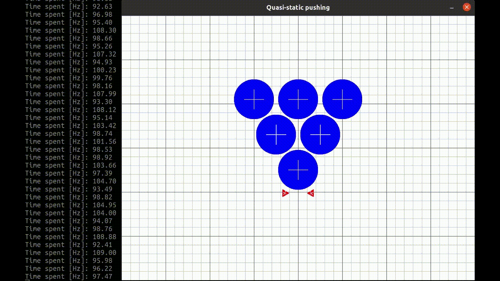
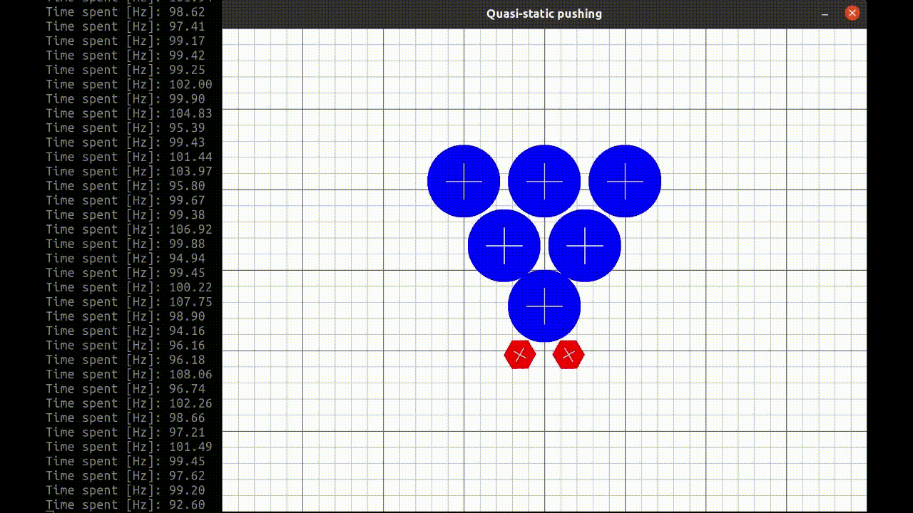

# quasi-static-push-grasp-simulation
Quasi-static pushing and grasping simulator

- This repository is no longer maintained.
- The simulation has been migrated from Python to C++.

- For the updated C++ version, please refer to the following repository:
[quasi-static-push-cpp](https://github.com/HJS-HJS/quasi-static-push-cpp)

# Obstacle Shape

  <table>
    <tr>
      <td align="center">
        
         <b>Circle</b>
      </td>
      <td align="center">
        
         <b>Ellipse</b>
      </td>
      <td align="center">
        
         <b>Super Ellipse</b>
      </td>
    </tr>
    <tr>
      <td align="center">
        
         <b>Right Polygon</b>
      </td>
      <td align="center">
        
         <b>Smooth Right Polygon</b>
      </td>
    </tr>
  </table>

# Pusher Shape

  <table>
    <tr>
      <td align="center">
        
         <b>Two Triangle</b>
      </td>
      <td align="center">
        
         <b>Two Regular Hexagon</b>
      </td>
      <td align="center">
        
         <b>Four Super Ellipse</b>
      </td>
    </tr>
  </table>

# Obstacle

  <table>
    <tr>
      <td align="center">
        
         <b>Not Moving Obstacle</b>
      </td>
    </tr>
  </table>

